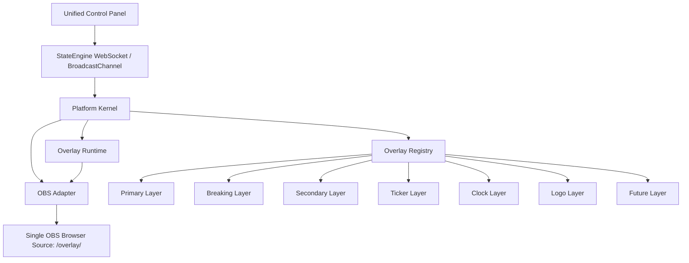

# System Architecture

The **AV Media Telangana Broadcast Kit** now separates the legacy modular overlay reference system from the new Single Overlay Platform runtime.

---

## Single Overlay Platform Diagram



---

## Platform Responsibilities

1. **Platform Kernel**: boots the overlay platform, owns lifecycle state, routes events, and exposes health snapshots.
2. **Overlay Registry**: registers layers dynamically and orders them by priority instead of hardcoded DOM assumptions.
3. **Overlay Runtime**: mounts layers, applies state updates, runs the frame loop, and calls adapter lifecycle methods.
4. **OBS Adapter**: owns OBS Browser Source assumptions such as 1920x1080 sizing, transparent canvas, diagnostics, and error reporting.
5. **StateEngine Bridge**: keeps the existing control-panel WebSocket/BroadcastChannel message shape and routes it into the platform.

---

## Dataflow & State Synchronization

1. Operator actions originate in the unified control panel.
2. `StateEngine` emits the existing protocol frame over WebSocket, BroadcastChannel, and localStorage fallback.
3. `PlatformKernel` normalizes the frame and maps the engine name to a registered layer.
4. `OverlayRuntime` updates the target layer state and visibility.
5. `OBSAdapter` reports runtime diagnostics and keeps Browser Source assumptions isolated.

---

## Legacy Reference Architecture

The previous multi-source model remains in the repository as reference material:

```text
modules/ticker/
modules/primary-headline/
modules/secondary-playlist/
modules/breaking-news/
```

New platform work must not import legacy overlay engine classes. Legacy modules may be inspected for visual behavior, timing, typography, and acceptance criteria.
