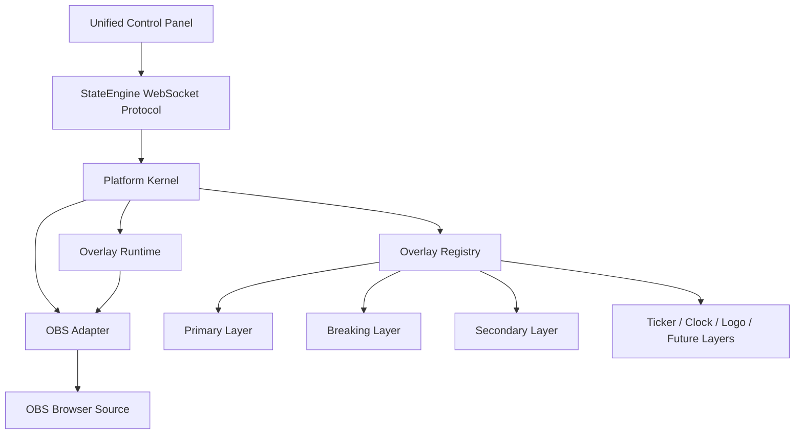

# Single Overlay Platform Developer Guide

## Purpose

The Single Overlay Platform is the new on-air runtime for AV Media Telangana graphics. It runs at:

```text
http://127.0.0.1:8085/overlay/
```

The existing module implementations are references only. New production overlays should be implemented against the platform kernel and runtime contract.

## Runtime Topology



## Layer Contract

M0 supports this adapter contract:

```js
{
  init({ layer, element, surface }) {},
  update({ layer, event }) {},
  show({ layer, event }) {},
  hide({ layer, event }) {},
  destroy({ layer }) {}
}
```

The proposed M1 refinement is:

```js
{
  init(context) {},
  mount(context) {},
  update(context) {},
  show(context) {},
  hide(context) {},
  unmount(context) {},
  destroy(context) {}
}
```

Do not start production feature overlays until M1 decides whether to adopt the expanded contract.

## Development Rules

- Use `/overlay/` for new on-air runtime development.
- Keep the control panel as the single operator interface.
- Preserve the current WebSocket message shape unless a later ADR changes it.
- Do not import legacy overlay engine classes into the new platform.
- Register layers through `OverlayRegistry`; do not hardcode layer DOM ordering outside the registry.
- Keep OBS-specific assumptions inside `OBSAdapter`.

## M0 Status

M0 is frozen at `v0.0.1-m0-walking-skeleton`.

M1 may begin only after the freeze commit, annotated tag, and release notes are published.
